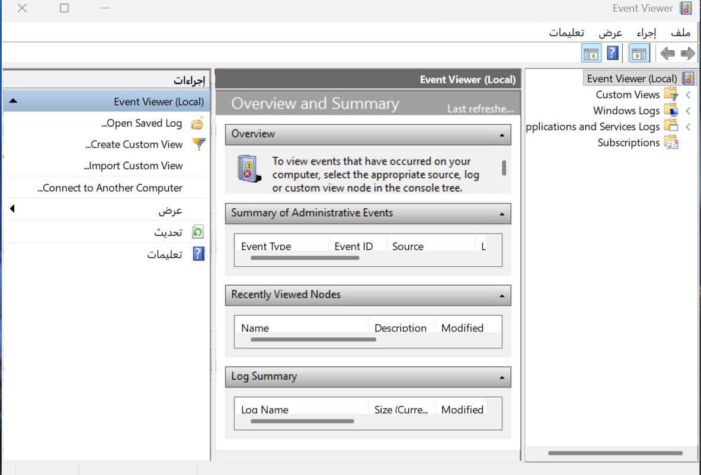
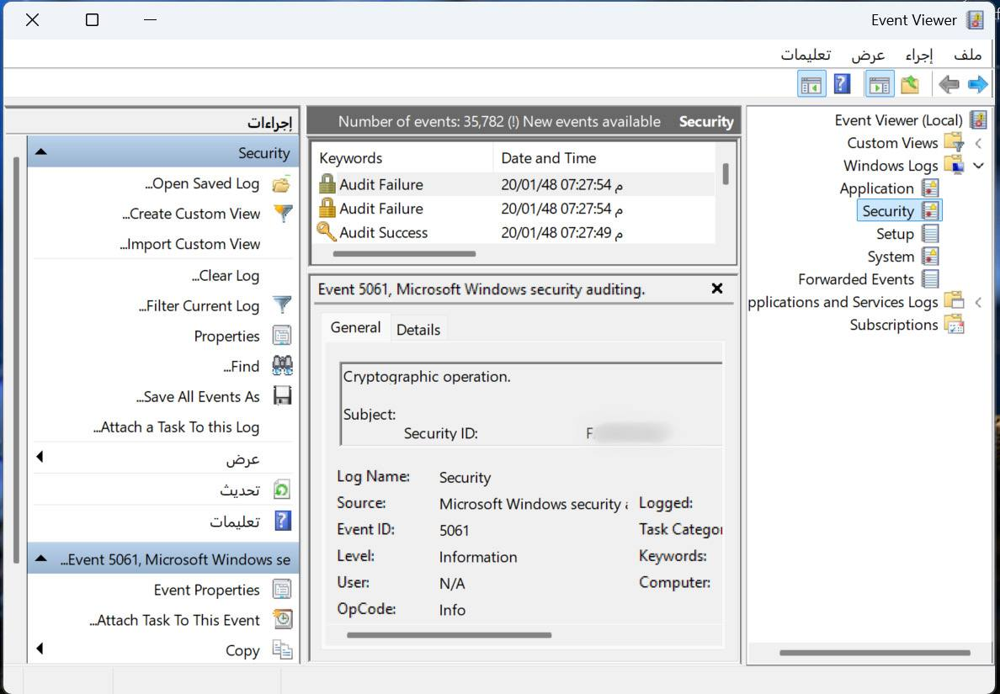
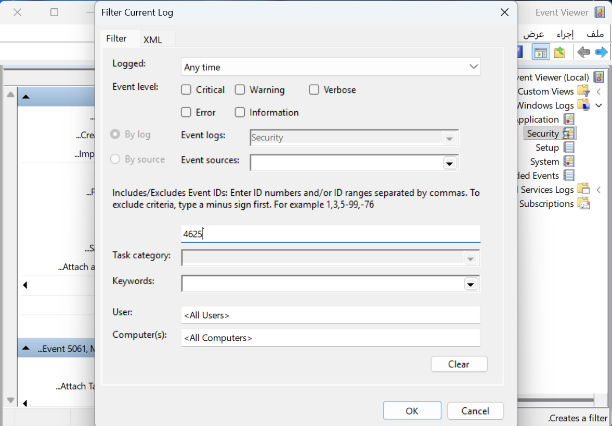
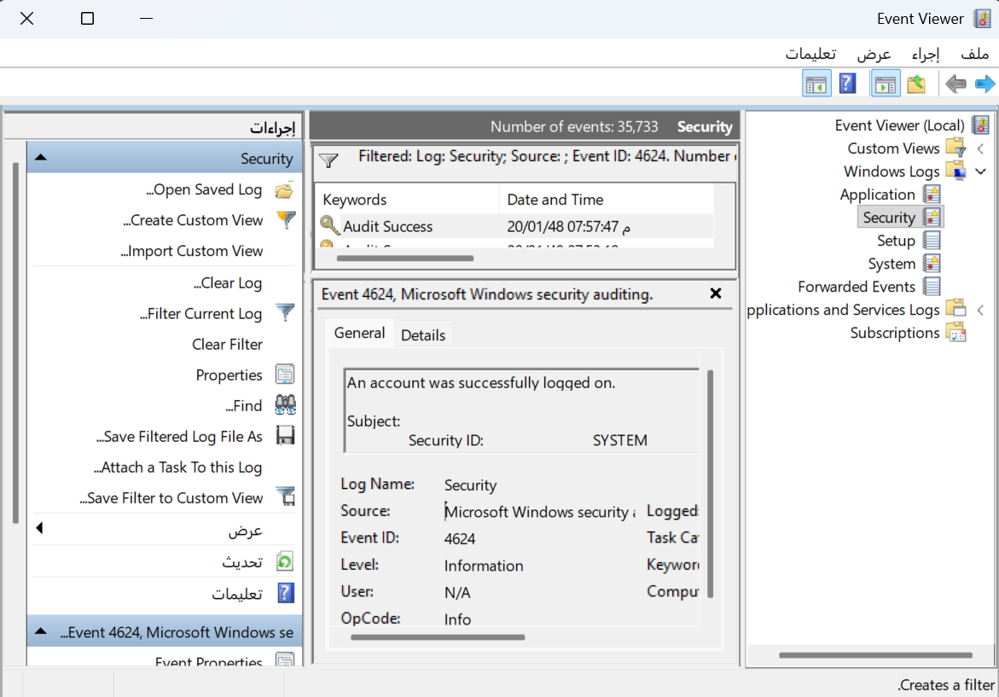
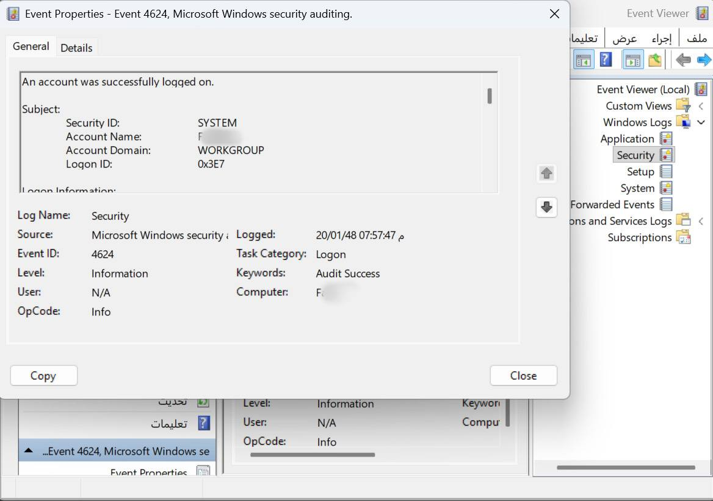
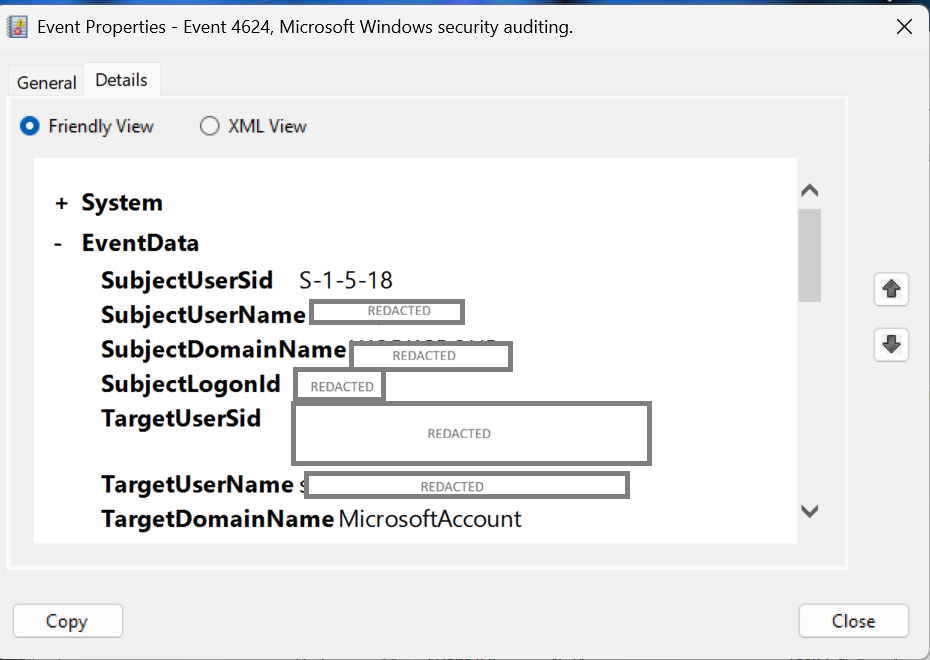

# 🛡️ Case #001 – Windows Event Log Investigation

## Overview

This repository documents the investigation of Windows Security Event Logs to identify suspicious activity, collect evidence, and document the findings following a structured SOC investigation process.

The investigation focused on reviewing Windows Security Logs, filtering relevant Event IDs, analyzing log details, and documenting the findings based on standard incident investigation practices.

---

## Scenario

A Windows workstation displayed unusual behavior.

The objective was to investigate the system using Windows Event Logs and determine whether any suspicious activity had occurred.

---

## Environment

- Windows Operating System
- Windows Event Viewer
- Windows Security Logs

### Evidence

**Figure 1. Event Viewer Overview**

---

## Tools Used

- Windows Event Viewer
- Windows Security Logs
- GitHub

---

## Investigation

### Step 1 — Open Event Viewer

The investigation began by opening Windows Event Viewer and navigating to the **Security** log, where authentication and security-related events are recorded.

### Evidence

**Figure 2. Windows Security Log**

---

### Step 2 — Filter Relevant Event IDs

To narrow the investigation, the Security log was filtered using a specific Event ID.

Event ID **4625** was selected to search for failed logon attempts.

### Evidence

**Figure 3. Filtering Security Logs by Event ID 4625**

---

### Step 3 — Review Related Security Events

The filtered results were reviewed to identify authentication events and examine the associated log entries.

During the investigation, Event ID **4624** (Successful Logon) was also examined to better understand normal authentication activity and compare relevant log events.

### Evidence

**Figure 4. Event ID 4624 Logon Event**

---

### Step 4 — Analyze Event Properties

The event properties were reviewed to examine important information such as:

- Event ID
- Log Name
- Logged Time
- Security Identifier (SID)
- Account Name
- Logon Type

### Evidence

**Figure 5. Event ID 4624 Properties**

---

### Step 5 — Review Event Details

The Details tab was inspected to review the structured event data and verify additional information related to the authentication event.

Sensitive information has been redacted for privacy.

### Evidence

**Figure 6. Event ID 4624 Details**

---

## Findings

The investigation successfully identified and reviewed Windows Security Events related to user authentication.

Relevant Event IDs were analyzed, supporting evidence was collected, and the findings were documented following a structured SOC investigation methodology.

---

## Risk Assessment

| Category | Assessment |
|----------|------------|
| Likelihood | Low |
| Impact | Low |
| Overall Risk | Low |

No confirmed indicators of malicious activity were identified during this investigation.

The analyzed events were consistent with normal Windows authentication activity and were used to demonstrate the investigation workflow.

---

## Analyst's Conclusion

The investigation demonstrated a structured approach to Windows Event Log analysis.

Relevant Security Events were reviewed, event details were examined, and the available evidence was documented.

Although no malicious activity was confirmed, the investigation illustrates the standard workflow used by SOC analysts when reviewing Windows Security Logs.

---

## Recommendations

- Regularly review Windows Security Event Logs.
- Monitor authentication-related Event IDs.
- Investigate repeated failed logon attempts.
- Correlate multiple log sources during incident investigations.
- Document investigation findings using a structured methodology.

---

## Lessons Learned

- Windows Security Logs provide valuable evidence during investigations.
- Filtering Event IDs improves investigation efficiency.
- Event correlation helps analysts understand system activity.
- Structured documentation improves incident reporting and knowledge sharing.

---

## Skills Demonstrated

- Windows Event Log Analysis
- Windows Event Viewer
- Security Log Analysis
- Event ID Investigation
- Log Correlation
- Evidence Collection
- Incident Investigation
- Risk Assessment
- Technical Documentation
